= FxLDAP
Vedran Bauer
v1.35 2020-03-01
github https://github.com/veilluka/fxLdap

== Introduction

Implementation of LDAP Client with JavaFX.
It is the result of two requirements, which the other ldap browsers did not support,
and which I needed during my daily work.
It was not intended to be a replacement for some other LDAP clients, but it did grow over time.

Used:

 * https://github.com/RobertBColton/DockFX/blob/master/src/main/java/org/dockfx/DockPane.java[dockfx] to build
GUI with docked windows.
*  secured-properties

== FEATURES

=== LDAP Compare

You can compare two instances of LDAP Tree in real time. This is something
I use very often to compare production and integration enviroment or any other enviroments.
Or you can export the LDAP tree in a file and compare them.
It is possible to copy entries from source to target or only some values.

* Compare LDAP instances online
* Compare LDAP files
* Copy entries src to target online
* Copy entries file src to target
* Export entries and compare with some external program (like beyond compare)

=== LDAP Text Search

Very often I have to search for some text in subtree without knowing in which attribute the text
is stored. Or sometimes the whole content of the attribute is stored in base64, for example a content of
xml File is stored in some attribute like this.

[source,xml]
----
<xml>
<user>admin</user>
<server>main_server</server>
</xml>

----
This is stored as base64 in LDAP and search would give no result if you search for "main_server".

* Search plain text in LDAP tree or file
* replace plain text in entry or subtree

== Quick Start

*After starting the program for the first time you must define master password.*

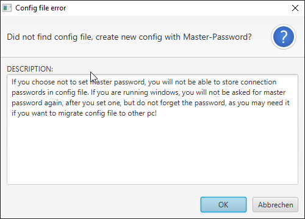

CAUTION: The length of the password must correspond to the local JAVA security settings.
It can be problematic from 16 characters.
Standard JAVA Cryptopolicy only allows a certain key size. Otherwise adjust the file
`JAVA_HOME/lib/security/java.security`. Remove comment at `crypto.policy=unlimited`.

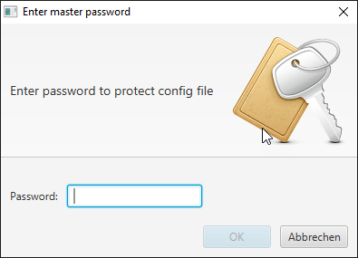

*Open settings and define a connection first.*

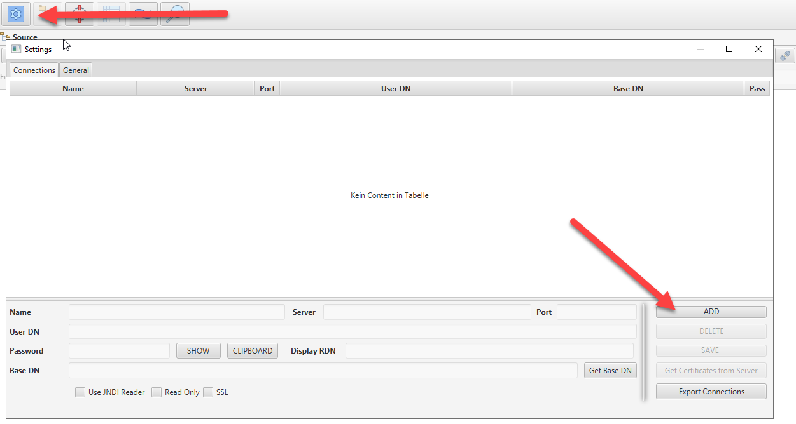

*This connection can be selected in main window to connect to the server.*

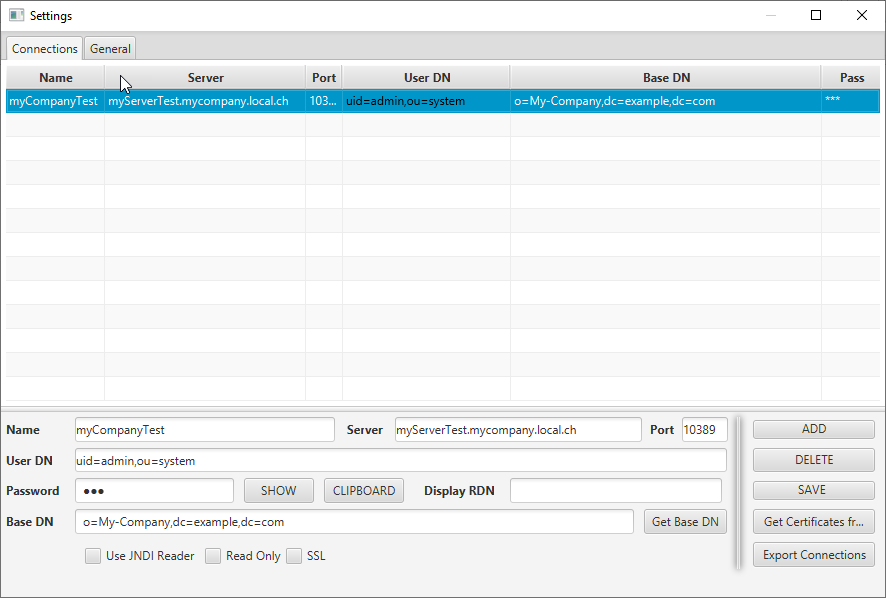

*Select the connection and connect*

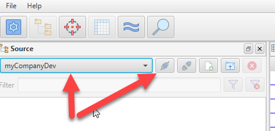

*select the tree you want to search in and press the right mouse button*

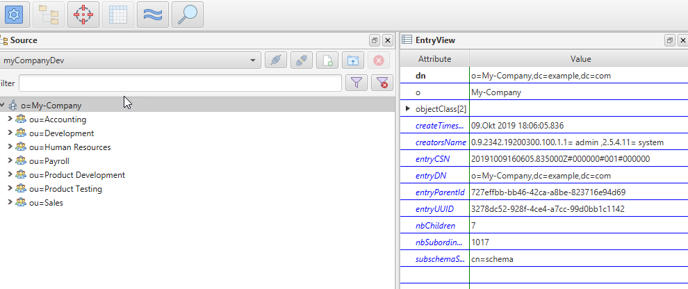

*click on search*

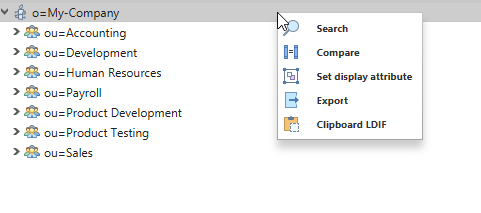

*enter the text you want to search for*

You can exclude attributes you do not want to search in (ignore)
or select only attributes you want to search in (compare).
If filter is disabled, it will search in all attributes.

*click on search button*

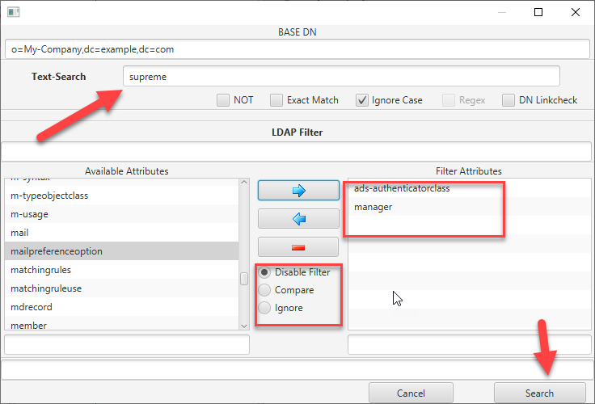

*Search window will appear with search results*

This icon shows entries where text has been found

image::src/main/resources/icons/Alert.png[found]

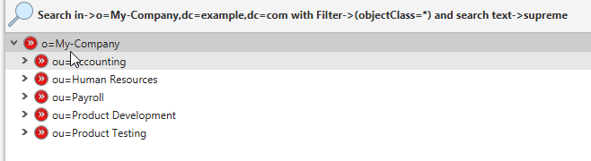

*select entry, in entry view the attribute where the value is found is marked red*

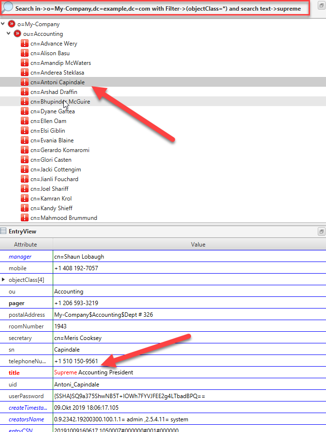

* you can now mark (multiselect with mouse) entries and
**  replace this value with some other value
** Delete entries
** Export to a file
** copy entry to clipboard as ldif

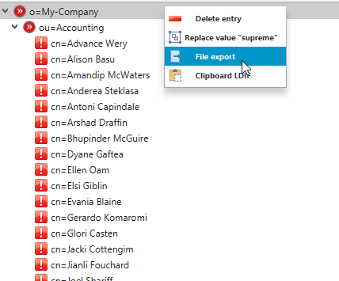

*example for exporting*

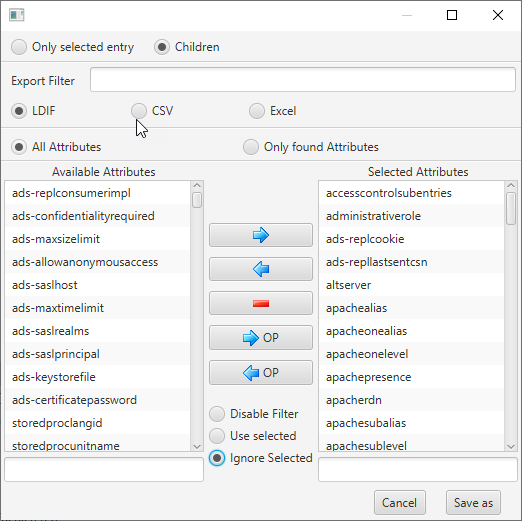

=== LDAP and LDIF Compare

==== LDIF Files Compare

* open target window
* open source ldif file
* open target ldif file

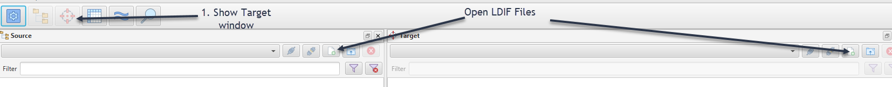

Now you see both files in Ldap/Ldif Explorer.

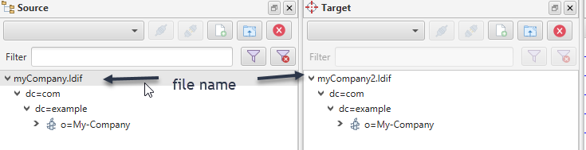

To compare them, select start DN in source file and start DN in target File.
Right mouse click in target window and click on compare.

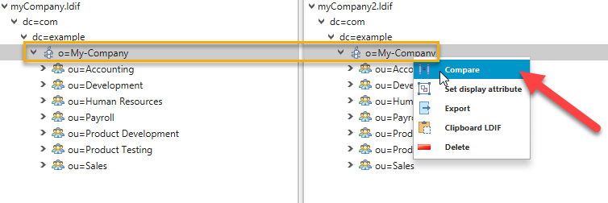

In next windows just click on "run compare".

After compare is done, new compare window will be shown.

`>>` Entry same as in target, but children are not

`!` Entry in source and target are not same

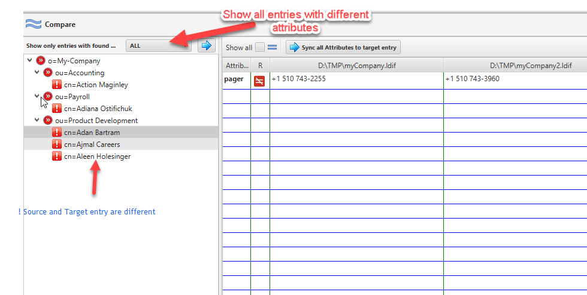

Show only entries where selected attribute is not equal

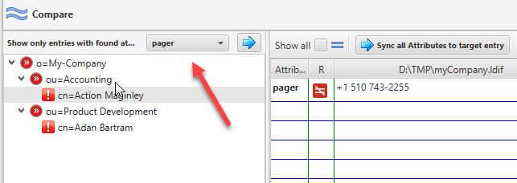

Copy selected attribute on the whole tree

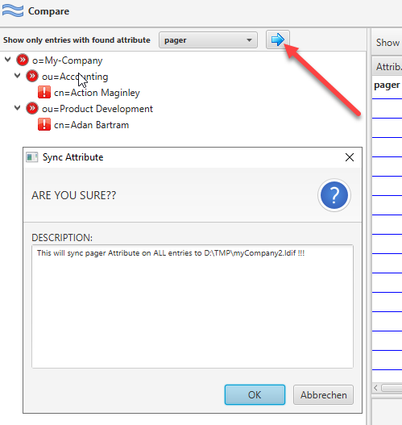

Sync only one attribute on selected entry (right mouse on attribute)

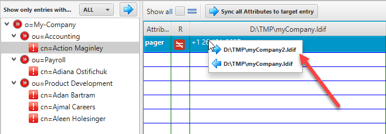

Sync one attribute on selected entries.
Select more entries and with right mouse button you can select the attribute to sync.

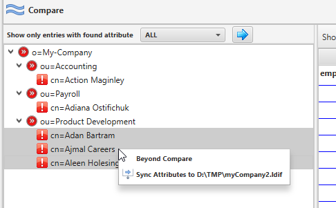

You can do this for online LDAP instances as well.
Just open LDAP connection to source and in target window to target LDAP.
Select start DN to compare on both and start compare with right mouse button
on selected target entry.

